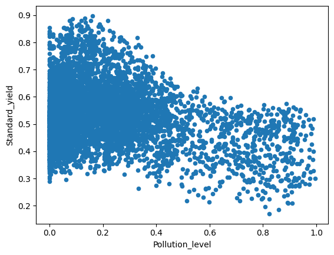

# Integrated Project: Understanding Maji Ndogo's Agriculture

## 📌 Project Overview
This project focuses on the intersection of data science and agriculture. Using Python and SQL, I analyzed agricultural data from Maji Ndogo to identify patterns in soil fertility, climate conditions, and crop yields.

## 🛠️ Tech Stack
- **Language:** Python
- **Libraries:** Pandas, SQLAlchemy, Matplotlib
- **Database:** SQLite

## 📊 Key Highlights
- **Data Integration:** Unified multiple SQL tables (Weather, Soil, Farm Management) into a single analytical dataset.
- **Data Cleaning:** Handled inconsistent crop naming, standardized elevation data, and addressed missing values.
- **Exploratory Data Analysis:** Analyzed the relationship between rainfall, elevation, and the success of different crop types.
- 

## 🏃 How to Run
1. Clone this repository.
2. Ensure you have the `.db` file in the root directory.
3. Install dependencies: `pip install -r requirements.txt`
4. Open the Jupyter Notebook to view the analysis.
